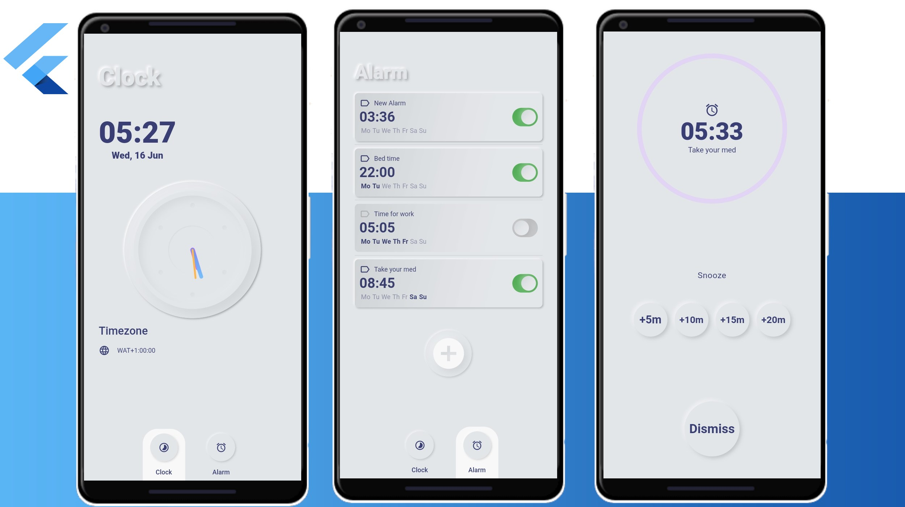
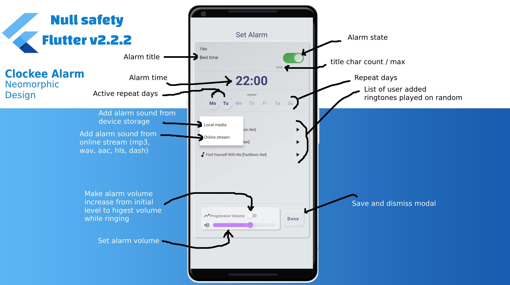

# Clockee -- Flutter Clock and Alarm app

A minimalistic flutter clock and alarm app based on an idea from [@NoMad](https://devrant.com/users/NoMad) which can be found [here.](https://devrant.com/rants/3708896/i-have-an-android-app-suggestion-a-different-alarm-clock-wakes-you-up-by-increas)

### Unique Features

- Play alarm tone from Online Media Stream (supports mp3, wav, aac, hls, dash).
- Add multiple sounds per alarm which are played on random.
- Simplistic snooze and dismiss actions
- Progress volume option (Increments alarm sound slowly to highest volume while playing).
- Neomorphic UI Design

### Setbacks (Ideas Needed)

- Alarm on Android 10+: Since the [recent restrictions](https://developer.android.com/guide/components/activities/background-starts) starting from Android 10, apps are no longer able to bring an activity to foreground without user's action. This update prevents the app from displaying it's alarm screen when not actively open or when the device is in a locked state. In other to bypass this setback, we would have to go with Google's recommended approach of displaying the alarm as a notification when the app is not active or device is locked. While this sounds okay for an alarm, it kills the main features of the app as listed above.

- Alarm on iOS: Similar to Android 10+, we can't bring the app to foreground when not active without the user's action. It's fine to go with notification as a mode of alert also but like we've noticed, most of the app features (i.e play from stream, progressive sound, etc.) would not be feasible since we are playing sound from a notification context.

Implementation of the notification option is in progress but if you have an idea or possible workaround asides this method. Please feel free to add them as comments [on here.](https://devrant.com/rants/3708896/i-have-an-android-app-suggestion-a-different-alarm-clock-wakes-you-up-by-increas)

You can join the development by submitting a clean pull request.

[Download APK sample here](sample/)

## Getting Started

This project is a starting point for a Flutter application.

A few resources to get you started if this is your first Flutter project:

- [Lab: Write your first Flutter app](https://flutter.dev/docs/get-started/codelab)
- [Cookbook: Useful Flutter samples](https://flutter.dev/docs/cookbook)

For help getting started with Flutter, view our
[online documentation](https://flutter.dev/docs), which offers tutorials,
samples, guidance on mobile development, and a full API reference.
